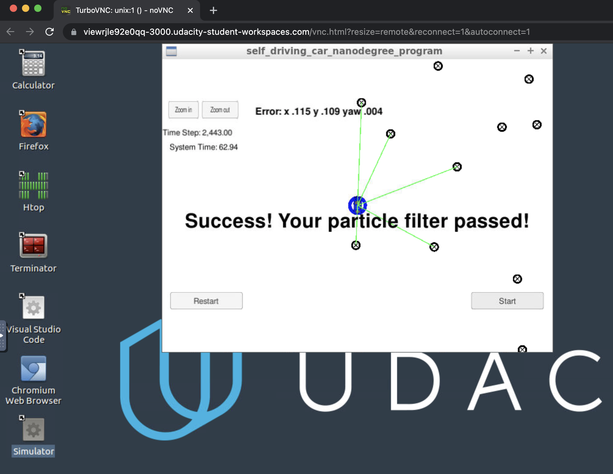
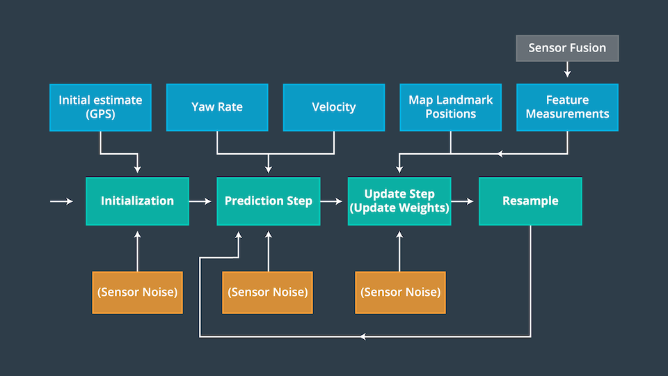
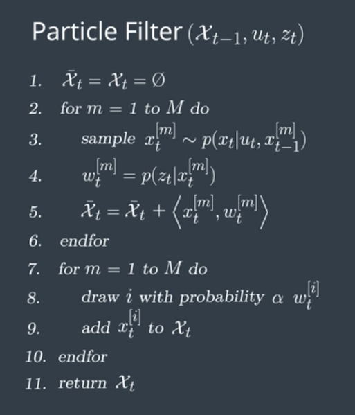

# Kidnapped Vehicle Project

I completed this project as part of [Udacity](https://www.udacity.com)'s [Self-driving Car Engineer Nanodegree](https://www.udacity.com/course/self-driving-car-engineer-nanodegree--nd013). 

Problem statement for this project:
> Your robot has been kidnapped and transported to a new location! Luckily it has a map of this location, a (noisy) GPS estimate of its initial location, and lots of (noisy) sensor and control data.

The goal of this project is to implement a **2-dimensional particle filter** in C++. The  particle filter will be given a map and some initial localization information (analogous to what a GPS would provide). At each time step the filter will also get observation and control data.

This animated GIF shows an extract of my particle filter in action as it communicates with the simulator:


This is a sparse localization problem, i.e., we are building an end-to-end localizer where we are localizing relative to a sparse set of landmarks using particle filters. 

# Project Results

## Accuracy
My particle filter localizes the vehicle to within the desired accuracy. The output says `"Success! Your particle filter passed!"` which means my particle filter meets this criterion. The screenshot confirms this:

Running On my Mac | Running On Udacity's Workspace and Simulator
:---:|:---:
|

The [logs](logs) directory contains a set of logs captured from different successful runs. One of the log files is [the output from running on Udacity's simulator](logs/output_udacity_sim.txt); the other three are from running on my Mac.

## Performance
My particle runs within the specified time of 100 seconds. The output says `"Success! Your particle filter passed!"` which means my particle filter meets this criterion.

The image above shows the results of a test run where my particle filter completed in 48.86 seconds.

## General
My code uses a particle filter to localize the robot. My implementation follows the following Particle Filter Algorithm flowchart ([Udacity](#References)):



The `PartocleFilter` class in [particle_filter.cpp](src/particle_filter.cpp) implements the particle filter, and follows the flow outlined above, and in this pseudo-code ([Udacity](#References)): 



The primary functions in the particle filter class reflect the main steps described in the flowchart and pseudocode above, i.e., initialization, Prediction, update weights, and Resample:

* `ParticleFilter::Initialize` initializes all particles to first position (based on estimates of `x`, `y`, `theta` and their uncertainties from GPS) and all weights to `1`.
* `ParticleFilter::Prediction` adds measurements to each particle and add random Gaussian noise.
* `ParticleFilter::UpdateWeights` updates the weights of each particle using a multi-variate Gaussian distribution.
* `ParticleFilter::Resample` resamples particles with replacement with probability proportional to their weight.

# Building and running the project

## Code Style

This project employs [Google's C++ style guide](https://google.github.io/styleguide/cppguide.html).

## Code Structure
The content of [src](src) directory is as follows:

```
src
 |-- helper_functions.h
 |-- main.cpp
 |-- map.h
 |-- particle_filter.cpp
 |-- particle_filter.h
```

The file [particle_filter.cpp](src/particle_filter.cpp) contains the `ParticleFilter` class and associated methods. 

## Inputs to the Particle Filter
The inputs to the particle filter are in the [data](data) directory.

#### The Map
The file [map_data.txt](data/map_data.txt) in the [data](data) directory includes the position of landmarks (in meters) on an arbitrary Cartesian coordinate system. Each row has three columns:

x position | y position | landmark id
:---|:---|:---

This is a sample extract from [map_data.txt](data/map_data.txt) showing what the data looks like:

```text
...
-7.1285	-34.54	4
232.32	32.032	5
177.43	28.083	6
286.89	18.159	7
...
```

Map data provided by [3D Mapping Solutions GmbH](#References).

## Important Dependencies

* cmake >= 3.5
    * All OSes: [click here for installation instructions](https://cmake.org/install/)
* make >= 4.1 (Linux, Mac), 3.81 (Windows)
    * Linux: make is installed by default on most Linux distros
    * Mac: [install Xcode command line tools to get make](https://developer.apple.com/xcode/features/)
    * Windows: [Click here for installation instructions](http://gnuwin32.sourceforge.net/packages/make.htm)
* gcc/g++ >= 5.4
    * Linux: gcc / g++ is installed by default on most Linux distros
    * Mac: same deal as make - [install Xcode command line tools](https://developer.apple.com/xcode/features/)
    * Windows: recommend using [MinGW](http://www.mingw.org/)
* uWebSockets
    * Set up and install [uWebSocketIO](https://github.com/uWebSockets/uWebSockets)
    * Note: the branch `e94b6e1` is the version of `uWebSocketIO` that works with the Udacity simulator

## Basic Build Instructions

1. Clone this repo.
2. Make a build directory: `mkdir build && cd build`
3. Compile: `cmake .. && make`
    * On Windows, you may need to run: `cmake .. -G "Unix Makefiles" && make`
4. Run it: `./particle_filter`

Running the localizer from a command line produces the following output:

```text
./particle_filter 
Listening to port 4567
Connected!!!
highest w 0.000845635
average w 0.000739481
highest w 0.176343
average w 0.111015
highest w 0.0607588
average w 0.0365814
highest w 0.0291006
average w 0.0159773
...
```


# References
* Mapping Data. [3D Mapping Solutions GmbH](https://www.3d-mapping.de)
* Wikipedia. [Particle Filter](https://en.wikipedia.org/wiki/Particle_filter).
* http://en.cppreference.com/w/cpp/numeric/random/normal_distribution
* http://www.cplusplus.com/reference/random/default_random_engine/
* Wikipedia. [Multivariate Normal Distribution](https://en.wikipedia.org/wiki/Multivariate_normal_distribution).
* https://www.willamette.edu/~gorr/classes/GeneralGraphics/Transforms/transforms2d.htm
* http://planning.cs.uiuc.edu/node99.html
* http://en.cppreference.com/w/cpp/numeric/random/discrete_distribution
* University of Texas. [Coordinate Transformations](http://farside.ph.utexas.edu/teaching/336k/Newtonhtml/node153.html).
* Mini Physics. [Coordinate Transformation Under Rotation](https://www.miniphysics.com/coordinate-transformation-under-rotation.html).
* Udacity. [Self-driving Car Engineer Nanodegree](https://www.udacity.com/course/self-driving-car-engineer-nanodegree--nd013). GitHub repos, Knowledge base, student/mentor community chat.
* Sebastian Thrun, 2002. [Robotic mapping: A survey](http://robots.stanford.edu/papers/thrun.mapping-tr.pdf).
* Saeedi, S., Bodin, B., Wagstaff, H., Nisbet, A., Nardi, L., Mawer, J., Melot, N., Palomar, O., Vespa, E., Spink, T. and Gorgovan, C., 2018. [Navigating the landscape for real-time localization and mapping for robotics and virtual and augmented reality](https://arxiv.org/abs/1808.06352). Proceedings of the IEEE, 106(11), pp.2020-2039.
* Bolić, M., Djurić, P.M. and Hong, S., 2004. [Resampling algorithms for particle filters: A computational complexity perspective](http://www.ece.sunysb.edu/~djuric/Publications_files/p-journal04i.pdf). EURASIP Journal on Advances in Signal Processing, 2004(15), pp.1-11.
* Abdelali, H.A., Essannouni, F. and Aboutajdine, D., 2016. [Object tracking in video via particle filter](https://www.researchgate.net/profile/Hamd-Abdelali/publication/311157710_Object_tracking_in_video_via_particle_filter/links/59da0dd90f7e9b12b36d7c54/Object-tracking-in-video-via-particle-filter.pdf). International Journal of Intelligent Engineering Informatics, 4(3-4), pp.340-353.
