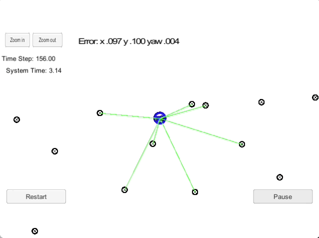
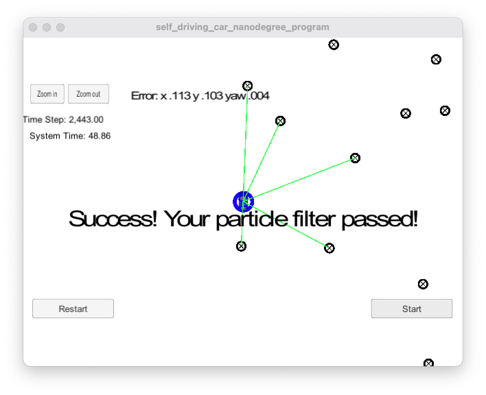

# Kidnapped Vehicle Project

This project is part of [Udacity](https://www.udacity.com)'s [Self-driving Car Engineer Nanodegree](https://www.udacity.com/course/self-driving-car-engineer-nanodegree--nd013) program. 

Problem statement:
> Your robot has been kidnapped and transported to a new location! Luckily it has a map of this location, a (noisy) GPS estimate of its initial location, and lots of (noisy) sensor and control data.

The goal of this project is to implement a 2-dimensional particle filter in C++. The  particle filter will be given a map and some initial localization information (analogous to what a GPS would provide). At each time step the filter will also get observation and control data.



# Project Specification

## Accuracy
My particle filter localizes the vehicle to within the desired accuracy. The output says `"Success! Your particle filter passed!"` which means my particle filter meets this criterion. The screen shot confirms this:



## Performance
My particle runs within the specified time of 100 seconds. The output says `"Success! Your particle filter passed!"` which means my particle filter meets this criterion.

The image above shows the results of a test run where my particle filter completed in 48.86 seconds.

## General
My code uses a particle filter to localize the robot.

The `PartocleFilter` class in [particle_filter.cpp](src/particle_filter.cpp) implements the particle filter. The primary functions of the particle filter class are:

* `ParticleFilter::init` initializes all particles to first position (based on estimates of `x`, `y`, `theta` and their uncertainties from GPS) and all weights to `1`.
* `ParticleFilter::prediction` adds measurements to each particle and add random Gaussian noise.
* `ParticleFilter::updateWeights` updates the weights of each particle using a multi-variate Gaussian distribution.
* `ParticleFilter::resample` resamples particles with replacement with probability proportional to their weight.

# Building and running the project

## Code Style

This project employs [Google's C++ style guide](https://google.github.io/styleguide/cppguide.html).

## Code Structure
The content of [src](src) directory is as follows:

```
src
 |-- helper_functions.h
 |-- main.cpp
 |-- map.h
 |-- particle_filter.cpp
 |-- particle_filter.h
```

The file [particle_filter.cpp](src/particle_filter.cpp) contains the `ParticleFilter` class and associated methods. 

## Inputs to the Particle Filter
The inputs to the particle filter are in the [data](data) directory.

#### The Map
The file [map_data.txt](data/map_data.txt) in the [data](data) directory includes the position of landmarks (in meters) on an arbitrary Cartesian coordinate system. Each row has three columns:

x position | y position | landmark id
:---|:---|:---

This is a sample extract from [map_data.txt](data/map_data.txt) showing what the data looks like:

```text
...
-7.1285	-34.54	4
232.32	32.032	5
177.43	28.083	6
286.89	18.159	7
...
```

Map data provided by [3D Mapping Solutions GmbH](#References).

## Important Dependencies

* cmake >= 3.5
    * All OSes: [click here for installation instructions](https://cmake.org/install/)
* make >= 4.1 (Linux, Mac), 3.81 (Windows)
    * Linux: make is installed by default on most Linux distros
    * Mac: [install Xcode command line tools to get make](https://developer.apple.com/xcode/features/)
    * Windows: [Click here for installation instructions](http://gnuwin32.sourceforge.net/packages/make.htm)
* gcc/g++ >= 5.4
    * Linux: gcc / g++ is installed by default on most Linux distros
    * Mac: same deal as make - [install Xcode command line tools](https://developer.apple.com/xcode/features/)
    * Windows: recommend using [MinGW](http://www.mingw.org/)
* uWebSockets
    * Set up and install [uWebSocketIO](https://github.com/uWebSockets/uWebSockets)
    * Note: the branch `e94b6e1` is the version of `uWebSocketIO` that works with the Udacity simulator

## Basic Build Instructions

1. Clone this repo.
2. Make a build directory: `mkdir build && cd build`
3. Compile: `cmake .. && make`
    * On windows, you may need to run: `cmake .. -G "Unix Makefiles" && make`
4. Run it: `./particle_filter`

# References
* Mapping Data. [3D Mapping Solutions GmbH](https://www.3d-mapping.de)
* Wikipedia. [Particle Filter](https://en.wikipedia.org/wiki/Particle_filter).
* http://en.cppreference.com/w/cpp/numeric/random/normal_distribution
* http://www.cplusplus.com/reference/random/default_random_engine/
* Wikipedia. [Multivariate Normal Distribution](https://en.wikipedia.org/wiki/Multivariate_normal_distribution).
* https://www.willamette.edu/~gorr/classes/GeneralGraphics/Transforms/transforms2d.htm
* http://planning.cs.uiuc.edu/node99.html
* http://en.cppreference.com/w/cpp/numeric/random/discrete_distribution
